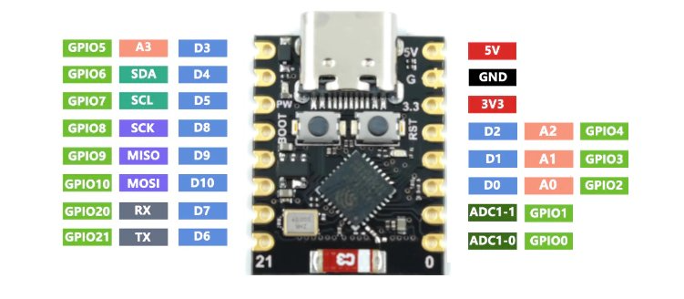
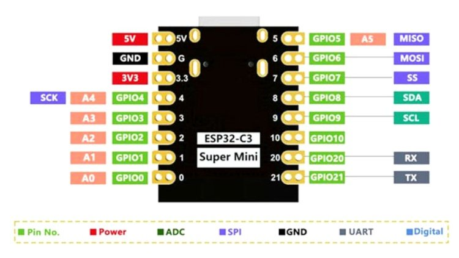

# 🌱 ESP32-C3 Super Mini – Soil Moisture Web Monitor

This project uses an **ESP32-C3 Super Mini** and a **capacitive soil moisture sensor** to monitor plant health.  
The ESP32-C3 reads the sensor via ADC, connects to WiFi, and serves a simple web page showing soil moisture as a raw value, percentage, and status (Dry / Moist / Wet).


---

## 🛠 Hardware

- ESP32-C3 Super Mini  
- Capacitive Soil Moisture Sensor v1.2 (3.3–5 V, analog output)  
- USB-C data cable (⚠️ not power-only)  
- Optional jumper wires / soldering

---

## 🔌 Wiring

| Sensor Pin | ESP32-C3 Super Mini |
|------------|---------------------|
| **GND**    | G (Ground)          |
| **VCC**    | 3.3V                |
| **AOUT**   | GPIO4 (ADC1_CH4)    |

⚠️ Only certain pins on the ESP32-C3 support ADC. Valid ADC pins: **GPIO0–GPIO5**.  
This project uses **GPIO4**.

---

## 💻 Arduino IDE Setup

1. Install [Arduino IDE](https://www.arduino.cc/en/software).  
2. Add ESP32 board support:  
   - File → Preferences → *Additional Board Manager URLs*:  
     ```
     https://raw.githubusercontent.com/espressif/arduino-esp32/gh-pages/package_esp32_index.json
     ```
   - Tools → Board → Boards Manager → Install **esp32 by Espressif Systems**.  
3. Select the correct settings:  
   - **Board**: `ESP32C3 Dev Module`  
   - **USB CDC On Boot**: `Enabled` ✅ (**IMPORTANT for Serial Monitor to work**)  
   - **Upload Speed**: `115200`  
   - **Port**: the one labeled *ESP32 Family Device*  

---

## ⚡️ Uploading Notes for ESP32-C3 Super Mini

- The Super Mini uses **native USB CDC** instead of a USB-UART bridge.  
- If **USB CDC On Boot** is disabled, flashing still works but **Serial Monitor will show nothing**.  
- With CDC enabled, `Serial.println()` output appears normally.  
- If uploads fail with `Hard resetting via RTS pin...`, try:  
  - Unplug/replug the board  
  - Lower upload speed to `115200`  
  - (Rare) hold **GPIO9 → GND** during upload, release after “Connecting…”

---

## 📜 Example Sketch

See [`src/SoilMoistureWeb.ino`](src/SoilMoistureWeb.ino).  

The sketch:  
- Connects to WiFi  
- Reads the soil sensor on **GPIO4**  
- Serves a webpage at `http://<ESP32_IP>/` showing:  
  - Raw ADC value  
  - Moisture percentage  
  - Dry / Moist / Wet status  

---

## 🌍 Usage

1. Flash the `.ino` sketch to your ESP32-C3 Super Mini.  
2. Open Serial Monitor at **115200 baud**.  
3. Wait for the WiFi connection — the IP address will be printed.  
4. Open the IP in a browser → see soil moisture live (% + status).  

---

## 📏 Calibration

The map range in code (`4095` = dry, `1200` = wet) is approximate.  
To calibrate:  

- Insert sensor in **dry soil** → note ADC reading.  
- Insert in **wet soil** → note ADC reading.  
- Update the `map()` function with your own min/max values.

---

## ✅ Next Steps

- Log data to Home Assistant, InfluxDB, or MQTT.  
- Add OLED display.  
- Run on LiPo battery with deep sleep for outdoor plants.  
